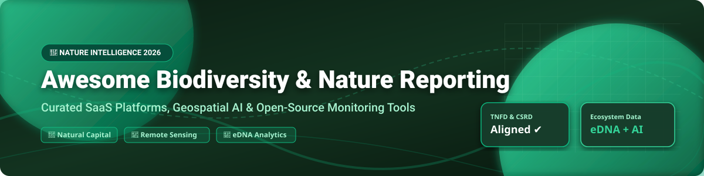

# Awesome Biodiversity & Nature Reporting 🌿📊

  
  
  
  

## 🚀 Top Biodiversity & Nature Reporting Ecosystem

**Curated List of SaaS Platforms & Open-Source GitHub Projects**  
*Focused on Nature Intelligence, Remote Sensing, Ecosystem Monitoring, eDNA Analytics & Corporate Sustainability Frameworks (TNFD, CSRD ESRS E4, SBTN & UN GBF)*  

*Last updated: September 2026* 📅

---

### 💡 Overview & Market Dynamics

> **Market Size & Structure**: The global Biodiversity & Nature Risk Analytics market is estimated at **$1.8 Billion to $2.5 Billion (2026)**, projected to expand rapidly at 22%+ CAGR driven by mandatory corporate disclosure mandates like CSRD ESRS E4 and TNFD LEAP alignment. The market is **moderately fragmented**: specialized geospatial satellite imagery vendors (e.g., Planet Insights) and proprietary eDNA testing providers (e.g., NatureMetrics) hold category leadership, while ESG reporting suites (e.g., Plan A) compete alongside a growing ecosystem of open-source frameworks.

---

## 📋 Table of Contents 📌

- [SaaS & Hosted Platforms](#-saas--hosted-platforms)
- [Open-Source GitHub Projects](#-open-source-github-projects)
- [Framework Comparison & Selection Guide](#-framework-comparison--selection-guide)
- [How to Contribute](#-how-to-contribute)
- [Support & Sponsorship](#-support--sponsorship)
- [Disclaimer](#-disclaimer)
- [Star History](#-star-history)

---

## 🏢 SaaS & Hosted Platforms

Below is the structured breakdown of leading commercial SaaS platforms evaluated by corporate valuation / estimated revenue size, pricing tiers, and free trial limitations:

| Platform 🌐 | Scale (Valuation / Revenue) 📈 | Pricing (Starting Tier) 💵 | Free Tier Limit / Free Trial 🎁 | Core Features & Description 🛠️ |
| :--- | :--- | :--- | :--- | :--- |
| **[Planet Insights](https://www.planet.com/)** | **$6 Billion Valuation** ($391M Annual Revenue) | $1,200/month (Commercial Base License) | **30-Day Free Trial** (Includes Planet Sandbox static dataset, Sentinel/Landsat imagery & monitoring credits; no satellite re-tasking) | High-frequency satellite imagery & automated geospatial AI analytics for land-use, forest canopy change, and ecosystem monitoring. |
| **[NatureMetrics](https://naturemetrics.com/)** | **$100M - $500M Valuation** ($25M Series B Raised, ~$15M Revenue) | $350 per eDNA sampling kit / $2,500/year site monitoring platform license | **No Permanent Free Plan** (Free platform demo available; complimentary field blank kits provided on bulk order of 20+ aquatic kits) | World leader in eDNA sampling & bioacoustics analytics. Generates TNFD/CSRD Ecosystem Condition Indices verified against 4.3M+ species detections. |
| **[Plan A](https://plana.earth/)** | **$150M - $250M Valuation** ($40M Total Funding Raised) | $1,200/month ($14,400 billed annually for Basic Enterprise Tier) | **No Free Trial** (Custom guided interactive demo provided upon request) | Comprehensive ESG carbon accounting and biodiversity disclosure platform supporting Scope 3 impact drivers & CSRD alignment. |
| **[GIST Impact](https://gistimpact.com/)** | **$40M - $80M Valuation** (~$8M Annual Revenue) | $800/month ($9,600/year starter assessment subscription) | **14-Day Limited Trial** (Access to sample corporate portfolio impact valuation datasets and risk screening sandbox) | Natural capital & biodiversity impact valuation software using proprietary spatial data to calculate dollar-denominated environmental impacts. |
| **[NatureAlpha](https://naturealpha.com/)** | **$25M - $50M Valuation** (~$5M Annual Revenue) | $1,500/month (Financial Portfolio Analytics License) | **7-Day Institutional Trial** (Access to limited 50-company biodiversity footprint screening report) | Nature analytics platform tailored for asset managers & banks to evaluate portfolio risk alignment against TNFD and SBTN targets. |
| **[Impact Observatory](https://impactobservatory.com/)** | **$20M - $40M Valuation** (~$4M Annual Revenue) | $500/month (Pro Land Mapping Tier) | **14-Day Free Trial** (Includes 10 free 10m-resolution land cover map exports for custom areas of interest) | Deep-learning automated land cover classification using Sentinel-2 and Landsat data for habitat intactness tracking. |
| **[Global Forest Watch Pro](https://pro.globalforestwatch.org/)** | **WRI Non-Profit Initiative** ($10M+ Annual Grant Operational Budget) | Free Grant Tier / $1,000/year Enterprise API Tier | **5,000 Ha Annual Free Processing** (Free tier covers up to 5,000 hectares processed; transitions to GNW Horizon free tool in Dec 2026) | Supply chain deforestation monitoring by World Resources Institute. Enables corporate risk mapping across agricultural commodities. |
| **[Climate Engine](https://climateengine.com/)** | **$15M - $30M Valuation** (~$3M Annual Revenue) | $350/month (Analytics Professional Tier) | **30-Day Academic & Research Free Trial** (Full access to climate indices & drought monitoring tools for 1 AOI) | Cloud-native geospatial analytics leveraging Google Earth Engine to compute drought, surface temperature, and ecological indicators. |
| **[Map of Life](https://mol.org/)** | **Yale / Enterprise Funded** (~$2M Annual Operational Budget) | $250/month (Commercial Developer API Tier) | **Free Forever Non-Commercial Tier** (5,000 API calls/month for open research & species range mapping) | Global biodiversity mapping framework combining species distribution data, habitat suitability, and conservation prioritization. |
| **[NatureQuant](https://naturequant.com/)** | **$10M - $20M Valuation** (~$1.5M Annual Revenue) | $199/month (NatureScore API Starter Tier) | **Free Developer Sandbox** (1,000 free NatureScore API requests for location-based nature exposure measurement) | Quantifies natural environment exposure (NatureScore & NatureDose) to assess health impact and urban green space coverage. |

---

## 💻 Open-Source GitHub Projects

Explore top-rated open-source repositories for self-hosting, geospatial pipeline automation, taxonomic indexing, and independent biodiversity metrics calculation. *Sorted by GitHub Star Count (Descending)* 🌟:

- **[microsoft/Biodiversity](https://github.com/microsoft/Biodiversity)**   
  🤖 **Microsoft AI for Good Lab** — Comprehensive open-source AI tools, deep learning models, and edge computing software for biodiversity monitoring. Contains MegaDetector for camera-trap animal detection, Bioacoustics ML pipelines, and PyTorchWildlife framework.

- **[ropensci/taxize](https://github.com/ropensci/taxize)**   
  🏷️ **Taxonomic Toolbelt for R** — Interacts with 20+ global taxonomic databases (NCBI, ITIS, GBIF, COL) to standardize, clean, and verify species names across biodiversity reporting pipelines.

- **[openforis/sepal](https://github.com/openforis/sepal)**   
  🛰️ **FAO Open Foris SEPAL** — System for Earth Observation Data Access, Processing, and Analysis for Land Monitoring. Cloud-based platform enabling autonomous remote-sensing processing, land cover classification, and forest monitoring.

- **[pyinat/pyinaturalist](https://github.com/pyinat/pyinaturalist)**   
  🐍 **Python Client for iNaturalist** — Async-enabled Python API wrapper to query citizen science biodiversity observations, species identification data, and georeferenced species occurrence records.

- **[ropensci/rgbif](https://github.com/ropensci/rgbif)**   
  🌍 **Interface to Global Biodiversity Information Facility (GBIF)** — R package for fetching, mapping, and analyzing GBIF species occurrence data worldwide for environmental impact assessments.

- **[gbif/pygbif](https://github.com/gbif/pygbif)**   
  🐍 **Official Python Client for GBIF** — Python library interfacing with GBIF occurrence, species taxonomy, and registry REST APIs.

- **[prioritizr/prioritizr](https://github.com/prioritizr/prioritizr)**   
  📐 **Systematic Conservation Prioritization in R** — Uses integer linear programming (ILP) to build spatial conservation plans that maximize biodiversity protection while minimizing socioeconomic costs.

- **[openforis/collect-earth-online](https://github.com/openforis/collect-earth-online)**   
  👁️ **Collect Earth Online (CEO)** — Open-source, crowd-sourced visual interpretation platform for satellite imagery land collection, baseline ecosystem mapping, and forest canopy analysis.

- **[openforis/collect](https://github.com/openforis/collect)**   
  📋 **Open Foris Collect** — Data management system for environmental and field inventories, facilitating field data entry, validation, and hierarchical data modeling.

- **[openforis/arena](https://github.com/openforis/arena)**   
  🌲 **Open Foris Arena** — Next-generation enterprise platform for national forest inventories, statistical processing, and land assessment workflows.

- **[GEO-BON/bon-in-a-box-pipeline-engine](https://github.com/GEO-BON/bon-in-a-box-pipeline-engine)**   
  📦 **BON in a Box (GEO BON)** — Modular pipeline engine converting Earth observation data into Essential Biodiversity Variables (EBVs) and Global Biodiversity Framework (GBF) indicators.

- **[HeleneGutte/ecorisk](https://github.com/HeleneGutte/ecorisk)**   
  ⚠️ **Ecosystem Risk Assessment Framework** — R package for semi-quantitative and quantitative ecological risk evaluation, vulnerability scoring, and stressor aggregation.

- **[TEJASCHAVAN22/-Biodiversity-Estimation-Using-MODIS-NDVI-Land-Cover-2023-](https://github.com/TEJASCHAVAN22/-Biodiversity-Estimation-Using-MODIS-NDVI-Land-Cover-2023-)**   
  🛰️ **MODIS & GEE Biodiversity Estimator** — Google Earth Engine workflow calculating Shannon and Simpson diversity indices via MODIS NDVI time-series.

- **[anytko/biospat](https://github.com/anytko/biospat)**   
  🗺️ **Biodiversity Spatial Analysis in Python** — Python package measuring spatial species range distribution, trailing edge dynamics, and ecosystem functional traits.

---

## 🛠️ Framework Comparison & Selection Guide

- **For Enterprise Corporate Disclosure (TNFD LEAP & CSRD ESRS E4)**: Combine **NatureMetrics** (for verified eDNA species ground-truth) with **Planet Insights** (for satellite supply chain land monitoring).
- **For Open & Self-Hosted Infrastructure**: Deploy **Open Foris SEPAL** and **Collect Earth Online** alongside **BON in a Box** pipelines to build transparent, auditable indicators without software lock-in.
- **For Academic & Conservation Prioritization**: Use **prioritizr** for optimal land allocation and **taxize** / **rgbif** for species data harmonization.

---

## 🤝 How to Contribute 📝

1. Fork this repository 🍴
2. Add/edit entries in `README.md` following the established table / star badge format.
3. Verify that SaaS entries include specific pricing, free trial limits, and valuation data, and open-source repos include verified GitHub star count links.
4. Open a Pull Request with a summary of changes 🚀

---

## 💖 Support & Sponsorship

Thank you for exploring and using this curated resource! If you find this list helpful for your sustainability research, corporate disclosures, or open-source projects, please consider supporting the project:

- ⭐ **Star** this repository on GitHub to help others discover it.
- 🔀 **Fork** and share it with your colleagues, sustainability teams, and researchers.
- ☕ **Buy Me a Coffee**: If you'd like to support ongoing maintenance and research, visit the [GitHub Sponsor Dashboard](https://github.com/sponsors/ishandutta2007).

---

## ⚠️ Disclaimer

- This curated list is maintained by the community for informational and research purposes.
- SaaS prices, valuations, and open-source star counts are updated periodically (Last check: September 2026).
- Satellite-based metrics and eDNA monitoring complement each other; remote sensing does not eliminate the need for ground-truth field sampling in regulated disclosure contexts.

---

## 📈 Star History

---

  <b>Designed for Sustainability Leads, ESG Analysts, Remote Sensing Scientists & Conservation Tech Developers 🌿📊</b>

